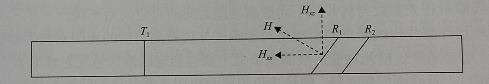

# 随钻方位成像电阻率测井技术

## 1. 技术概述
### 1.1 电阻率测井技术
地层电性参数主要包括：
- 自然电位
- 电阻率
- 介电常数

电阻率测井技术： 基于地层导电性(电阻率或电导率)研究地层特性的一类测井方法。分为**普通电阻率测井、侧向电阻率测井、感应电阻率测井**。

#### 1.1.1 **普通电阻率测井**
- 最早使用的测井方法，该方法比较简单，是其他电阻率测井方法的基础。
- 原理：普通的电极系放入井内，通过供电电极向地层发射电流，测量两个检测电极之间的电压差以求得地层电阻率的测井方法。
- 在**高矿化度钻井液**和**高阻薄层**的井中,由于**导电钻井液或低阻围岩的分流作用**，普通电阻率测并难以进行分层和确定地层真电阻率。因此，普通电阻率测井往往**只适用低阻地层测井**，而且**探测深度较浅**。
#### **侧向电阻率测井**
- 为了减小钻井液的分流作用和低阻围岩的影响，增加探测深度及电阻率测量范围，是在普通电阻率测井基础上提出的。
- 原理：侧向电阻率测井按供电和聚焦电极系结构、数量的不同，通常分为**双侧向、三侧向、七侧向、微侧向、邻近侧向、微球形聚焦测井**等。聚焦供电使电流具有方向选择性，从而可以探知不同方向上的地层电阻率分布情况(李启明等，2014)。
- 侧向电阻率测井通过聚焦方式把电流发射到围岩中，其测量通路模型相当于**钻井液、泥饼、侵入带和目标地层各电阻的串联**，串联电路中大电阻贡献大，所以侧向电阻率测井适合**导电钻井液测井工况**，而且特别适合**高阻地层(碳酸盐、致密岩层之类)电阻率的测量**。
#### **感应电阻率测井**
- 描述：电磁感应原理研究目标地层导电性的一种测井方法。
- 原理：感应电阻率测井采用电磁感应原理实现信号的激励和采集，其感应涡流电流的方向平行于水平岩层界面，受围岩影响较小。
- 感应电阻率测井的测量通路模型可以看作是钻井液、泥饼侵入带和目标地层各电阻的并联，并联电路中小电阻贡献大，所以感应电阻率测井特别适合**不导电钻井液下低阻地层电阻率的测量**。
#### **电磁波电阻率测井**
- 电磁波电阻率测井又称为电磁波传播电阻率测井，
- 原理：通过检测电磁波信号在地层传播过程中发生的相位滞后或幅值衰减研究地层电学特性的方法(刘乃震等，2015)。
- 电磁波测井激励频率较高，受井内钻井液影响比较小。但是在高电阻率地层中，随着测频率的升高，地层介电性逐渐起主导性作用，使得电阻率参数的测量受到影响。因此，电磁波电阻率测井主要适用于**中低电阻率地层的测量**。

### 1.2 随钻电阻率技术进展
电法测井可分为**电缆测井**和**随钻测井**两大类。
- 电缆测井是(wireline logging)在钻井作业完成后，通过电缆将测井装置放入井内工作。
- 随钻测井(logging while drilling,LWD)则在钻井作业的同时实现地层参数测量。此时的钻井液(探过程中井眼内使用的循环冲洗介质)尚未或者较少侵入地层,因此随钻测井能够在第-时间获得原始地质信息。

#### 1.2.1 随钻测井简介
- 随钻测井是钻井工程的关键技术手段，各类随钻测井方法和仪器广泛应用于石油勘探和开采领域。通过对地层的电、声、核和磁等各种物理信息的测量、处理、传输和解释，工程师可以判断出钻井状况是否安全，地下油气资源的储量是否丰富。
- 随钻电阻率测量包括**电磁波电阻率测量**和**侧向电阻率测量**。随钻电磁波电阻率测量的范围较大，但是分辨率较低，适合作为探边工具，不适合作为实现井壁清晰成像，反映井壁裂缝、溶洞和地层走向的测井方式。
- 未来趋势：随钻高分辨率电阻率成像技术能够可视化展现井简周边地层的特征，成为随钻测井的发展方向，也是高端随钻测井技术的代表。

#### 1.2.2 随钻测井需求

- 高效地开采油气资源和增加油区产量，不得不将目标转向低幅度、薄层及难开采的次要油气层。在这类复杂的地质构造中，钻直井受到了限制，斜井、水平井等定向井的数目日渐增多。在这种条件下，电缆测井已不能满足需求，随钻测井是唯一可用的测井技术。
- 随钻测井和随钻测量(measurement whiledrilling)技术的突破，实现了**水平井**的实时地质导向，与早期的以三维空间几何体为目标的控制方式相比，地质导向控制方式以井眼是否钻达储层为评价标准，是一种更高级的井眼轨迹控制方式。
- **高分辨率地质导向钻井**是科技进步的必然产物，也是油气勘探开发对钻井的客观需求。

#### 1.2.3 国际发展
##### 1.2.3.1 随钻测井仪
- 斯伦贝谢(Schlumberger)公司的VISION系列、Scope系统
- 哈里伯顿(Halliburton)公司的AFR\ABRADR系统和贝克休斯(Baker Hughes)的 AziTrak系统等
- 提供多个探测深度的电阻率伽马及钻井方位、井斜和工具面等参数，能满足地层评价、地质导向和钻井工程应用的需要。
- 经过多年的发展，基于随钻测井的水平井地质导向技术已经成为**优化储层内井眼轨迹**、**提高泄油面积**、**实现油田增产**的新技术。

##### 1.2.3.2 地质导向工具

- 最早期具有方向性测量的地质导向工具为 GST，通过工具面的配合可以实现数据点形式的方向性伽马测量。
- 方向性测量出现以后，电阻率成像地质导向在此基础上也逐渐发展起来。它不仅可以提供上下、左右方向性测量，也可以提供全井眼的电阻率成像测量，这主要通过工具的旋转实现。
- 工具带有纽扣式的电阻率测量电极，随着工具旋转一周，能够获得全井眼的成像资料，为实施导向提供方向;通过专有的数据处理系统在成像图上拾取地层倾角，为导向过程地层倾角的判断提供有力依据。

##### 1.2.3.3 随钻高分辨率成像测井技术
薄储层开发迫切需要通过随钻高分辨率成像测井技术获取方向性测井数据，结合钻前地质背景预测钻井中实时局部构造的倾角变化分析，实现薄层钻井的地质导向。在井过程中通过井眼轨迹穿过地层界面位置的方向性测量和成像判断轨迹与地层之间的关系及计算地层视倾角，从而指导决策，最大限度地降低储层水平段的无效进尺、提高钻遇率、减少侧钻，在地层倾角不断变化、局部构造不确定的情况下，保证水平井按照最优的目标钻进。
- 国外公司在常规随钻电阻率测量技术已取得进展的基础上，正在加快研制方位探边和成像电阻率测量技术。
- 斯伦贝谢公司在 20世纪 80年代推出了随钻短电位电阻率仪器，它采用普通电位电极系，其探测深度浅且受井眼影响大。
##### 1.2.3.4 随钻侧向电阻率测井方法
- 为了规避随钻电极电流型电阻率测井遇到的技术难题，20世纪60年代，Arps提出一种随钻侧向电阻率测井方法，由发射线圈在钻挺或电极上产生感应电流流入地层，并由电极或接收线圈探测来自地层的电流。
- 1985年，Gianzero等推导了将螺绕环等效为磁流环的相关理论并考虑了频率影响。
- 1994年，Bonner 等对钻头电阻率仪器 RAB 的探测特性和测井响应进行了详细介绍，并提出了一种“圆柱形聚焦技术”，将测量电极前方的等位面恢复成圆柱形，克服了仪器在高电阻率地层中较差的测井响应。
- 20世纪 90年代初，**随钻感应电阻率测井仪**发展成熟并投入应用，随后发展到侧向电阻率成像测井，成为主流的随钻侧向电阻率测井。
- 国外的随钻成像测井技术已经比较成熟，几家主要的石油技术服务公司都相继推出了自己的随钻电阻率成像仪器。例如,斯伦贝谢公司的 RAB.GVR，哈里伯顿公司的 AFR 和贝克休斯的 StarTrak。 
不同随钻电阻率测井方法：
$$
\text { 表 } 1.1 \text { 不同随钻电阻率测井方法的主要优缺点对比}   
$$
$$
\begin{aligned}
&\begin{array}{|c|c|c|c|}
\hline \text { 参数 } & \text { 随钻侧向电阻率测井 } & \text { 随钻感应电阻率测井 } & \text { 随钻电磁波电阻率测井 } \\
\hline \text { 工作频率 } & \text { 直流电 } & 20 \mathrm{kHz} & 20 \mathrm{kHz} \sim 2 \mathrm{MHz} \\
\hline \text { 工作原理 } & \text { 欧姆定律 } & \text { 电磁感应 } & \text { 电磁波传播 } \\
\hline \text { 优点 } & \begin{array}{c}
\text { 纵向分辨率高, 有较强的薄层检测、 } \\
\text { 裂缝探测及渗透层识别能力 }
\end{array} & \begin{array}{l}
\text { 径向探测深度较大; 在测井 } \\
\text { 过程中不受钻井液的限制 }
\end{array} & \begin{array}{l}
\text { 可同时检测不同径向深度的地层电阻率参 } \\
\text { 数, 且在实际测井过程中不受钻井液的限制 }
\end{array} \\
\hline \text { 不足 } & \begin{array}{c}
\text { 径向探测深度较浅; 在实际测井过 } \\
\text { 程受钻井液的限制 }
\end{array} & \begin{array}{c}
\text { 仅能检测单一径向深度的 } \\
\text { 地层电阻率参数 }
\end{array} & \text { 线圈系制作工艺复杂 } \\
\hline
\end{array}
\end{aligned}
$$

## 2.随钻方位电磁波测井技术
### 2.1 随钻电磁波电阻率测井仪原理
- 随钻电磁波电阻率测井仪主要分为**常规随钻电磁波电阻率测井仪**和**随钻方位电磁波电阻率测井仪**，实际测井过程中测井仪检测电磁波信号在地层中传播时产生的幅度衰减和相位偏移即可反演计算所测地层的电阻率参数，从而实现测井仪的地层评价和地质导向。
- 随钻电磁波电阻率测井仪：可采用**多种工作频率**实现**不同径向深度**地层电阻率参数的检测。可精确地检测复杂钻井环境下的地层电阻率参数，有效地提高作业效率。由电磁波信号的传播特性可知，随钻电磁波电阻率测井仪在实际测井过程中不受钻井液条件的限制[$^1$](#1)，适用范围较广。
#### 2.1.1 随钻电磁波电阻率测井
常规随钻电磁波电阻率测井仪通过采用轴向发射-接收线圈实现地层电阻率参数的检测，其线圈系结构(以一发双收线圈系为例)如图 2.1所示。

$$
图 2.1 常规随钻电磁波电阻率测井仪线圈系结构图
$$
图 2.1 中, $T_1$ 为发射线圈, $R_1 、 R_2$ 为接收线圈, $L_1 、 L_2$ 分别为发射线圈 $T_1$ 到接收线圈 $R_1 、 R_2$ 的源距。由于线圈的半径远小于发射线圈到接收线圈的源距, 在实际测井过程中将线圈视为磁偶极子, 当线圈系结构工作于均匀介质地层中时, 根据麦克斯韦方程组可分别计算接收线圈 $R_1$ 和 $R_2$ 处感应电磁波信号的幅值和相位为 (高杰等, 2008)
$$
\begin{gathered}
\left|V_j\right|=\frac{\omega \mu S_{R j} n_{R j} M \mathrm{e}^{-\beta L_j}}{2 \pi L_j^3} \sqrt{\left(\alpha L_j\right)^2+\left(1+\beta L_j\right)^2}, \quad j=1,2 \tag{2.1}
\\
\end{gathered}
$$
$$
\begin{gathered}
\Phi_j=-\alpha L_j-\arctan \left(\frac{1+\beta L_j}{\alpha L_j}\right), \quad j=1,2 \tag{2.2}
\end{gathered}
$$
式中: 
$$ 
\alpha=\omega \sqrt{\frac{1}{2} \mu\left(\sqrt{\varepsilon^2+\frac{\sigma^2}{\omega^2}}+\varepsilon\right)} ; 
$$
$$
\beta=\omega \sqrt{\frac{1}{2} \mu\left(\sqrt{\varepsilon^2+\frac{\sigma^2}{\omega^2}}-\varepsilon\right)} ; 
$$
$$
\\ 其中 \omega \text { 为角频率, } \mathrm{rad} / \mathrm{s};\mu \text{为介质磁导率}, \mathrm{H} / \mathrm{m} ; \sigma \text{为地层介质电导率}, \mathrm{S} / \mathrm{m} ; \varepsilon 为介电常数, \mathrm{F} / \mathrm{m} ; S_{R j} \text {为接收线圈的横截面积}, \mathrm{m}^2 ; n_{R j} \text {为接收线圈的历数; M为磁偶极距}。

$$
由式 (2.1) 和式 (2.2) 即可计算相邻接收线圈处感应电磁波信号 $\left(V_1 、 V_2\right)$ 的幅度比 EATT 和相位差 $\Delta \Phi$ 分别为
$$
\begin{gathered}
\mathrm{EATT}=20 \lg \frac{\left|V_2\right|}{\left|V_1\right|} \tag{2.3}
\end{gathered}
$$
$$
\begin{gathered}
\Delta \Phi=\Phi_2-\Phi_1                                       \tag{2.4}
\end{gathered}
$$

由以上分析可知, 信号的幅度比 EATT 和相位差 $\Delta \Phi$ 是地层介质电导率 $\sigma$ 的函数,通过测量信号的幅度比和相位差即可反演得到所测地层的电阻率参数。
####  2.1.2 随钻方位电磁波电阻率测井
常规的随钻电磁波电阻率测井仪采用轴向线圈系结构, 可实现不同径向深度地层电阻率的检测, 但其通常采用轴向线圈系结构, 测量结果不具有方位特性。随钻方位电磁波电阻率测井仪在常规测井仪的基础上设置倾斜或水平线圈实现地层方位电阻率的检测, 更加精确地实现了测井仪的地层评价和地质导向功能 (宋殿光等, 2014)。其工作原理如图 2.2随钻方位电磁波电阻率测井仪工作原理示意图 所示。

$$
图 2.2 随钻方位电磁波电阻率测井仪工作原理示意图
$$
如图 2.2 所示, $T_1$ 为轴向发射线圈, $R_1 、 R_2$ 为倾斜接收线圈, $H$ 为接收线圈的磁矩方向, $H_{x x}$ 为沿轴向的磁矩分量, $H_{x z}$ 为垂直于轴向的磁矩分量。不同于常规随钻电磁波电阻率测井仪, 随钻方位电磁波电阻率测井仪通过设置水平或接收线圈, 可同时测量沿轴向的电场分量和垂直于轴向的电场分量, 则接收线圈处的感应电磁波信号可表示为：
$$
V=V_{x x}+V_{x z}\tag{2.5}
$$

式中, $V$ 表示接收线圈处的感应电磁波信号, $\mathrm{V} ; V_{x x}$ 表示感应电磁波信号沿轴向的分量, $\mathrm{V} ; V_{x z}$ 表示感应电磁波信号垂直于轴向的分量, $\mathrm{V}$ 。

因此, 可计算得到相邻接收线圈处感应电磁波信号的幅度比 EATT 和相位差 $\Delta \Phi$ 分别为
$$
\begin{gathered}
\text { EATT }=20 \lg \frac{\left|V_2\right|}{\left|V_1\right|}=20 \lg \frac{\left|V_{x x 2}\right|+\left|V_{x z 2}\right|}{\left|V_{x x 1}\right|+\left|V_{x z 1}\right|}  \tag{2.6}
\end{gathered}
$$
$$
\begin{gathered}
\Delta \Phi=\Phi_2-\Phi_1  \tag{2,7}
\end{gathered}
$$

## 备注问题

#### 随钻电磁波电阻率测井仪不受钻井液影响的主要原因
电磁波的传播特性主要包括以下几点：
1. **传播速**：电磁波在真空中的播速度是光速，大约为299,792公里每秒。在其他介质中，电磁波的速度会受到介质的电磁特性（如介电常数和磁导率）的影响而减慢。

2. **波长频率**：电磁波的波长与频成反比。波长是电磁波在一个周期内传播的距离，率是电磁波振荡的速度。电磁波的能量与频率成正比。

3. **衰减**：在传播过程中，电磁波的强度可能会因为吸收、散射等原因而减弱。不同介质对电磁波的衰减作用不同。

4. **折射和反射**：当电磁波从一种介质进入另一种介质时，会发生折射和反射现象。这些现象取决于两种介质的电磁属性差异。

5. **穿透能力**：电磁波的穿透能力取决于其频率。一般来说，频率较低的电磁波（如无线电波）能够穿透较厚的障碍物，而频率较高的电磁波（如X射线）穿透能力较弱。
- 随钻电磁波电阻率测井仪不受钻井液影响的主要原因在于它使用的**电磁波频率较高**，这使得电磁波的穿透能力得以增强，能够有效穿透钻井液和周围的介质。在高频条件下，电磁波主要与岩石的电性特性（如电阻率）相互作用，而对钻井液的电性影响相对较小。因此，即使钻井液的电阻率发生变化，也不会对测量结果产生显著影响，从而保证了测量数据的准确性和可靠性。这种特性使得随钻电磁波电阻率测井仪在复杂的钻井环境中特别有效。

